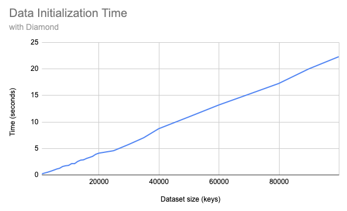

# Diamond

A read-only in-memory key/value storage optimized for maximum performance

## Installation

Coming soon to Hex!

## Usage

```elixir
data = %{foo: "bar", baz: "bong"}
:ok = Diamond.initialize(data)

"bar" = Diamond.get(:foo)
```

## Benchmarks (Read Times)

#### Small (1,000 keys)
```
Diamond           - 81_918_000 / sec  
:persistent_term  - 45_045_000 / sec  (1.8x slower)  
:ets (async)      -  9_176_000 / sec  (8x slower)  
GenServer (Map)   -    946_000 / sec  (86x slower)  
:ets (serialized) -    823_000 / sec  (99x slower)  
```
#### Medium (10,000 keys)
```
Diamond           - 72_992_000 / sec  
:persistent_term  - 39_354_000 / sec  (1.8x slower)  
:ets (async)      -  8_693_000 / sec  (8x slower)  
GenServer (Map)   -    928_000 / sec  (78x slower)  
:ets (serialized) -    823_000 / sec  (88x slower)  
```
#### Large (100,000 keys)
```
Diamond           - 57_844_000 / sec  
:persistent_term  - 34_447_000 / sec  (1.6x slower)  
:ets (async)      -  8_591_000 / sec  (6x slower)  
GenServer (Map)   -    922_000 / sec  (62x slower)  
:ets (serialized) -    821_000 / sec  (70x slower)  
```

## Benchmarks (Initialization Times)

The time to initialize the data into memory grows linearly with the size of your dataset.



Therefore, take care when initializing large datasets (especially 100,000+ keys).

## License

Copyright (C) 2024 Andrew P Berrien

This program is free software: you can redistribute it and/or modify it under the terms of the GNU General Public License as published by the Free Software Foundation, either version 3 of the License, or any later version.

This program is distributed in the hope that it will be useful, but WITHOUT ANY WARRANTY; without even the implied warranty of MERCHANTABILITY or FITNESS FOR A PARTICULAR PURPOSE. See the [GNU General Public License](https://www.gnu.org/licenses/gpl.html) for more details.

